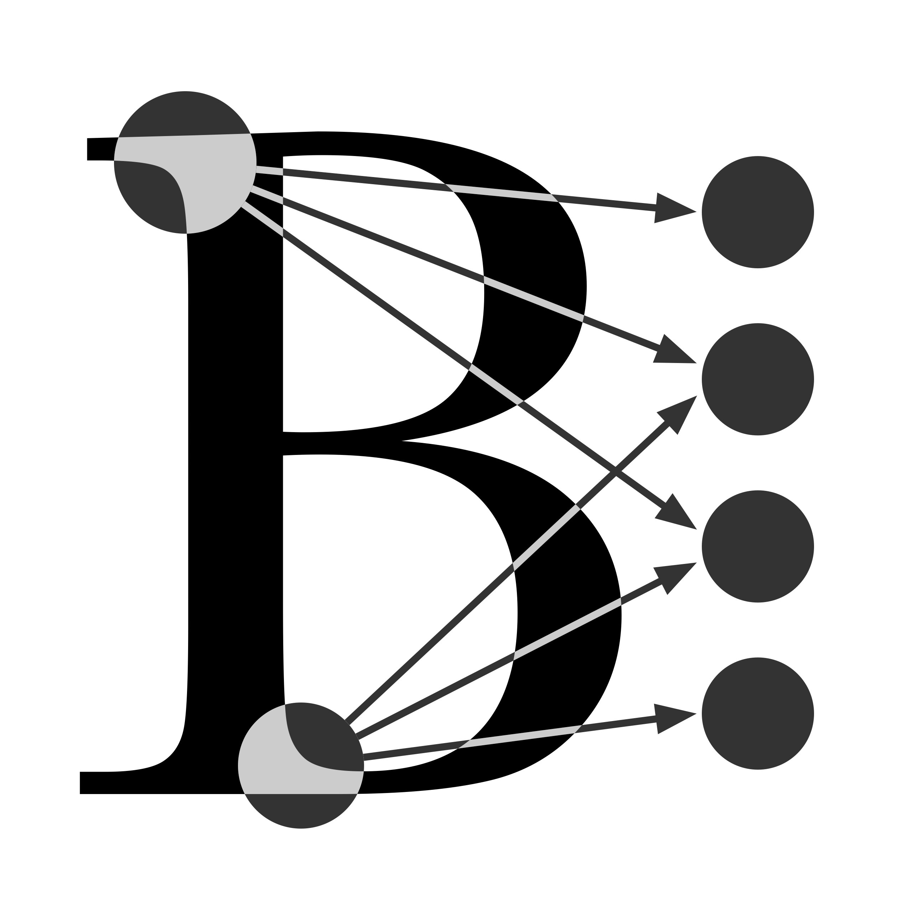

# Baskerville Remote Drop-In

## Wednesday 26th July | 9:30 - 17:00

<center></center>

The Baskerville team are holding a 1-day remote drop-in session for all users of the HPC cluster! This is your opportunity to ask our RSEs questions about how to use Baskerville.

## :calendar: Schedule

| Time          | Topic                                                                            | Led By | Helper | HackMD |
| ------------- | -------------------------------------------------------------------------------- | ------ | ------ | ------ |
| 09:30 - 10:30 | Logging in and Module Loading (1h)                                           | Dimitrios       |  Gavin      | James        |
| 10:30 - 10:45 | Break (15m)                                                                           |        |        |        |
| 10:45 - 12:15 | Non-Interactive Batch Jobs (`sbatch`) and Interactive Jobs (`srun`)  (1h30) | James & Gavin | Simon       | Jenny       |
| 12:15 - 13:15 | Lunch (1h)                                                                           |        |        |        |
| 13:15 - 14:30 | Self-installed software with `pip` and `conda`  (1h15)                      | Simon & Jenny | James       | Gavin       |
| 14:30 - 14:45 | Break (15m)                                                                           |        |        |        |
| 14:45 - 15:45 | VS Code Remote Tunnels  (1h)                                                 | Jenny  |  Simon      | Simon        |
| 14:45 - 15:45 | RELION Breakout Session (1h)                                                     | Gavin  | Dimitrios       | James       |
| 15:45 - 16:00 | Break (15m)                                                                            |        |        |        |
| 16:00 - 17:00 | Data Transfers with Globus  (1h)                                             | James  | Dimitrios       |  Gavin      |

## Content

```bash
2023-07-26-remote-drop-in
├── HackMD.md
├── LICENSE.md
├── README.md
├── img
│   └── logo.png
├── presentations
│   ├── 01-logging-in-and-module-loading
│   ├── 02a-non-interactive-batch-jobs
│   ├── 02b-interactive-jobs
│   ├── 03a-self-installed-software-with-pip
│   ├── 03b-self-installed-sotware-with-conda
│   ├── 04a-vscode-remote-development
│   └── 05-data-transfers-with-globus
└── src
    └── non-interactiveSlurm
    └── pip-scripts
```

## Support

For technical user support, email us at [baskerville-tier2-support@contacts.bham.ac.uk](mailto:baskerville-tier2-support@contacts.bham.ac.uk)

## Acknowledgements

* [Baskerville](https://github.com/baskerville-hpc)

## [License](LICENSE.md)

<a rel="license" href="http://creativecommons.org/licenses/by-nc-sa/4.0/"></a><br />This work is licensed under a <a rel="license" href="http://creativecommons.org/licenses/by-nc-sa/4.0/">Creative Commons Attribution-NonCommercial-ShareAlike 4.0 International License</a>.
